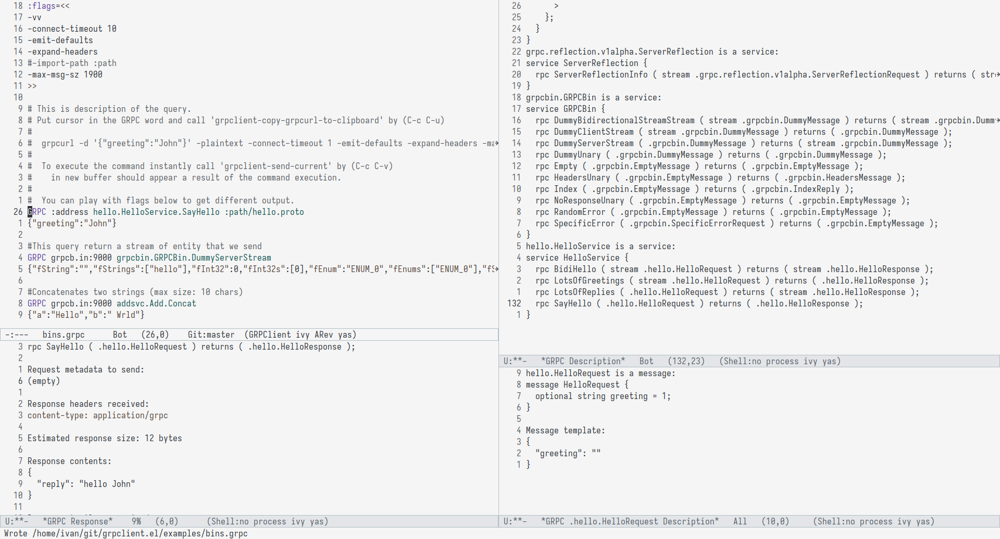

#+title: GRPClient

[[https://github.com/fullstorydev/grpcurl][gRPCurl]] query builder from plain-text sheets havily inspired by [[https://github.com/pashky/restclient.el][restclient.el]]

* Install
1. Install [[https://github.com/fullstorydev/grpcurl][gRPCurl]]
2. Clone repository to your local directory
3. Add following configuration in your ~init.el~ or ~.emacs~ file
#+begin_src emacs-lisp
(use-package grpclient
  :ensure nil
  :load-path "~/path/to/grpclient.el/"
  :init
  (add-to-list 'auto-mode-alist '("\\.grpc\\'" . grpclient-mode)))
#+end_src
4. Check [[file:examples/bins.grpc][example file]]

* Quick Insert (gRPC Reflection)
Insert complete gRPC requests using server reflection.  Uses
standard ~completing-read~ (works with consult, vertico, icomplete).

Set your server address at the top of the ~.grpc~ file:
#+begin_example
:address=grpcb.in:9000
#+end_example

Then bind ~grpclient-complete~ to a key (already bound to ~C-c C-c~
in ~grpclient-mode~) or call it via ~M-x~:
#+begin_src emacs-lisp
(use-package grpclient-completion
  :after grpclient
  :bind (:map grpclient-mode-map ("C-c C-c" . grpclient-complete)))
#+end_src

Calling ~grpclient-complete~ prompts for a method name with
completion, then inserts:
#+begin_example
GRPC :address <Service>/<Method>
{<message template>}

# end <Method>
#+end_example

Data flow:
  1. ~grpcurl list <server>~ → all service FQNs
  2. ~grpcurl describe <server> <service>~ → extract rpc methods + request types
  3. ~grpcurl -msg-template <server> describe <request_type>~ → extract JSON template

Cache is at ~/.emacs.d/.cache/grpcurl-autocomplete/~ (auto-refreshed every 24h).

| Command                    | Binding          | Description                      |
|----------------------------+------------------+----------------------------------|
| ~grpclient-complete~       | ~C-c C-c~        | Insert gRPC request at point     |
| ~grpclient-refresh-cache~  | ~M-x ...~        | Force-refetch reflection data    |
* Running the Example gRPC Server
To test the Emacs mode, you can start a local Python gRPC server serving both Proto2 and Proto3 examples.

The easiest way to start the server is to use the provided shell script. It will automatically create a virtual environment, install dependencies, compile the Protocol Buffers, and start the server.

#+begin_src bash
./examples/start_server.sh
#+end_src

The server will start on port =9000= with gRPC reflection enabled, making it easy to query using =grpcurl= and =grpclient-mode=.

* Key-map
| kdb     | function                            |
|---------+-------------------------------------|
| C-c C-v | grpclient-send-current              |
| C-c C-u | grpclient-copy-grpcurl-to-clipboard |
| C-c C-l | grpclient-describe                  |
| C-c C-c | grpclient-complete                  |
| <tab>   | grpclient-toggle-pretty-body        |
| M-x     | grpclient-refresh-cache             |

* Screenshot

* Demo
[[file:examples/grpclient-el.gif]]
